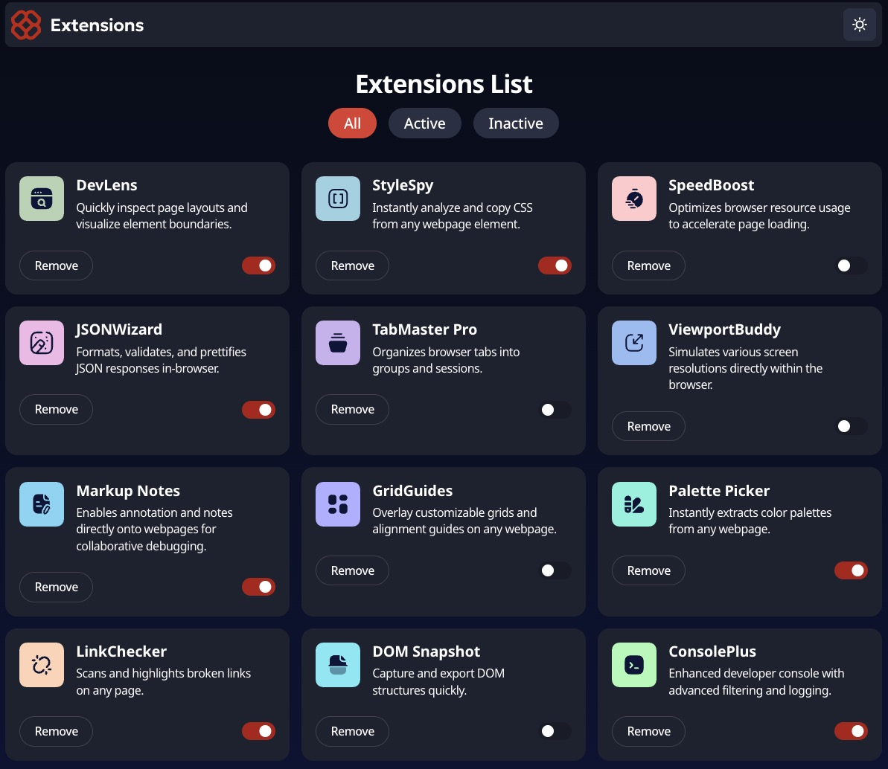

# 🧩 Extensions Manager

A modern, lightweight extensions manager built with React and Vite. It lets users toggle, filter, and remove extensions in a responsive, dark-mode-ready interface.

## ✨ Features

- ✅ Toggle extensions on/off
- 🗑 Remove extensions from the list
- 🎯 Filter by All / Active / Inactive
- 🌗 Light and Dark Mode support
- ⚡ Powered by React + Vite

## 📸 Preview



➡️ Live site: https://dzik0.github.io/browser-extension/

## 🚀 Tech Stack

- **React** (Functional components + Hooks)
- **clsx** for conditional class styling
- **Modular components** (`Header`, `Extension`, `FilterButton`)
- **JSON** as local data source

## 🧠 Code Overview

### State Management

- `apps`: The main extension list loaded from `data.json`
- `filter`: Current filter state (1 = All, 2 = Active, 3 = Inactive)
- `darkMode`: Boolean flag to switch UI theme

### Core Functions

- `toggleExtension(id)` – Toggle an extension's active state
- `removeExtension(id)` – Remove an extension from the list
- `changeFilter(id)` – Change the current filter view
- `toggleDarkMode()` – Toggle between light/dark UI

### Filtering Logic

```js
const appsOn = apps.filter((item) => item.isActive);
const appsOff = apps.filter((item) => !item.isActive);
```

### Render Logic

`renderExtensions()` handles the conditional rendering based on filter and extension availability.

## 📂 Project Structure

```
src/
├── comps/
│   ├── Header.jsx
│   ├── Extension.jsx
│   └── FilterButton.jsx
├── data.json
├── App.jsx
├── main.js
└── styles.css
```

## 🛠 Setup & Installation

1. **Clone the repo:**

   ```bash
   git clone https://github.com/your-username/extensions-manager.git
   ```

2. **Install dependencies:**

   ```bash
   npm install
   ```

3. **Run the development server:**

   ```bash
   npm run dev
   ```

## 📄 License

This project is open-source and available under the [MIT License](LICENSE).
